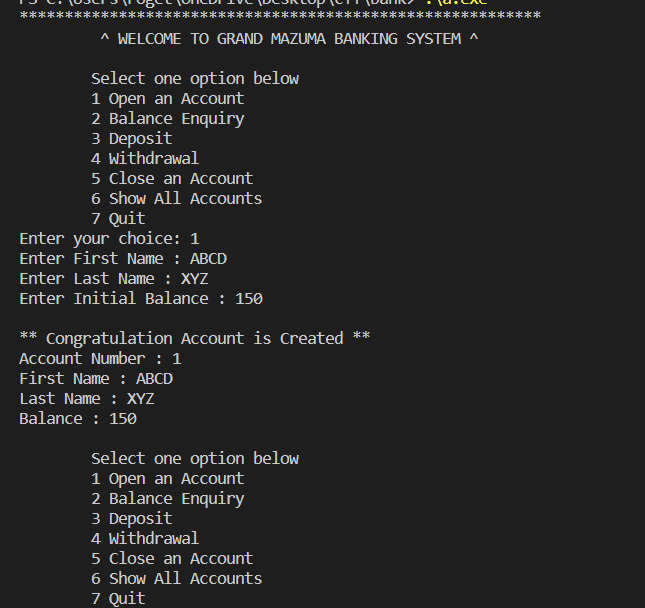
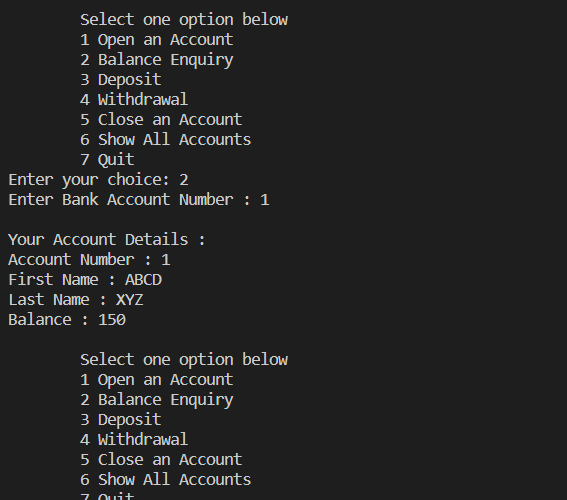
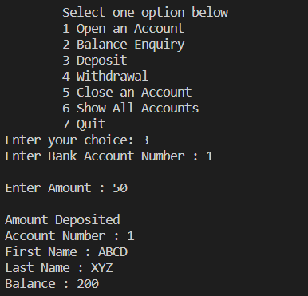
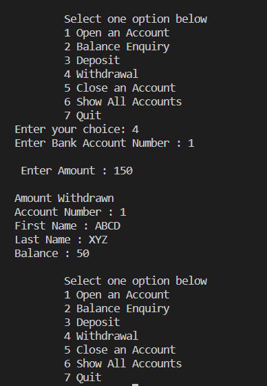

# Banking_system
Application of banking with the feature starting from creating an account, deposit, withdrawal, balance inquiry, and closing an account.
Implemented using  **C++ OOP'S concepts**.

